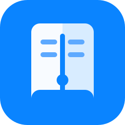

<div align="center">
  
  <h1>FocusAnchor / 专注阅读</h1>
  <p>面向注意力易分散读者的 Windows 桌面阅读器，让视线一次只处理一句或一个阅读区域。</p>
</div>

## 功能

- **本地书库**：导入 EPUB、PDF、TXT、Markdown 和 DOCX 文档。
- **逐句色块**：识别当前阅读范围内的句子，高亮当前句并弱化相邻句。
- **键盘导航**：使用 `↑` / `↓` 切换句子，使用 `←` / `→` 切换章节或页面。
- **阅读设置**：调整字号、行距、内容宽度以及纸白、暖色、夜间主题。
- **阅读进度**：自动保存每本文档的阅读位置。
- **笔记标注**：选中文本后添加彩色标注和笔记，可导出 Markdown 或 JSON。
- **微信读书**：在应用内登录微信读书，并使用逐句高亮、阅读窗、段落聚焦、鼠标跟随和阅读标尺。
- **专注计时**：提供 15、25 和 40 分钟专注时段。

所有本地文档、阅读进度和笔记均保存在当前设备。微信读书内容由其官方页面加载，登录会话仅保存在本机。

## 下载

前往 [Releases](https://github.com/William7j/FocusAnchor/releases/latest) 下载最新 Windows 安装包。

当前版本：[FocusAnchor v1.4.9](https://github.com/William7j/FocusAnchor/releases/tag/v1.4.9)

> 安装包暂未进行代码签名。Windows SmartScreen 可能显示“Windows 已保护你的电脑”，请在确认下载来源为本仓库后选择“更多信息”继续安装。

## 使用方法

### 本地文档

1. 启动应用，在“本地书库”中选择“导入文档”。
2. 打开文档，通过工具栏启用“逐句色块”。
3. 使用 `↑` / `↓` 或工具栏按钮移动当前句。
4. 选中文本可创建标注；右上角笔记按钮可查看、编辑和导出笔记。

### 微信读书

1. 切换到“微信读书”，使用微信扫码登录官方页面。
2. 在专注工具栏选择“阅读窗”或“段落”模式，或直接启用“逐句色块”。
3. 根据需要调整窗高、遮罩强度、鼠标跟随和专注时长。

## 本地开发

### 环境要求

- Windows 10 或更高版本
- Node.js 20+
- npm

### 安装与运行

```powershell
git clone https://github.com/William7j/FocusAnchor.git
cd FocusAnchor
npm install
npm run dev:windows
```

仅启动 Electron（需要先生成 `dist`）：

```powershell
npm run build
npm run start:windows
```

### 测试与构建

```powershell
npm test
npm run build
npm run package:windows
```

Windows 安装包默认输出到 `release/`。

## 技术栈

- Electron 39
- React 18 + TypeScript
- Vite 6
- Dexie / IndexedDB
- EPUB.js、PDF.js、Mammoth、Marked、KaTeX
- Vitest
- electron-builder / NSIS

## 项目结构

```text
electron/   Electron 主进程、预加载脚本与微信读书辅助逻辑
src/        React 界面、阅读器、数据层与内容处理
test/       Electron 安全、微信读书 Canvas 与集成测试
build/      应用图标和打包资源
```

## 许可证

本项目基于 [MIT License](LICENSE) 开源。
